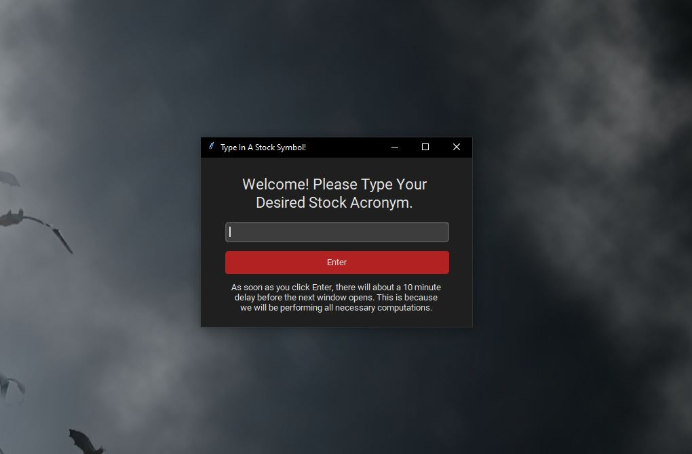
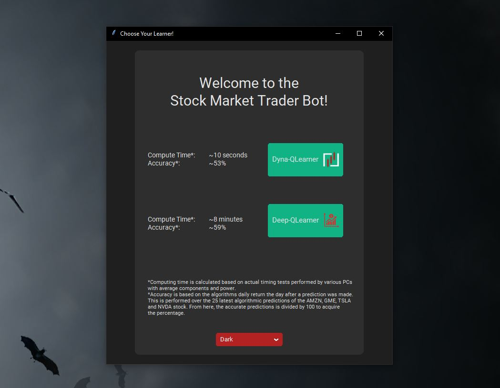
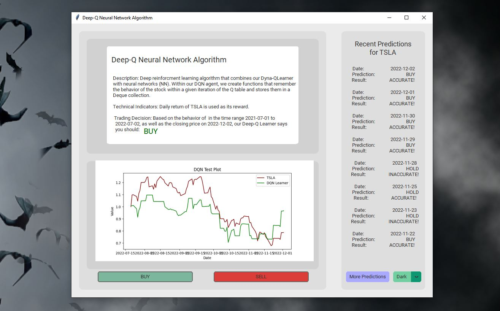
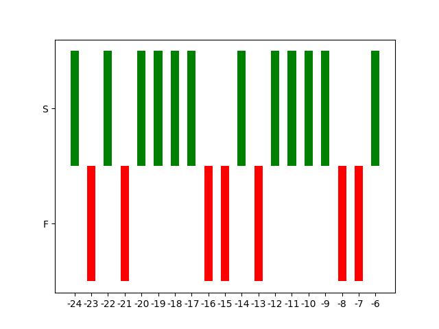

  This won best senior design project in my class of computer and electrical Engineers at FIU, however, I recognize a lot can be improved, but I would rather work on new and more interesting personal projects than improve this one. 

# Table of Contents
- [Table of Contents](#table-of-contents)
  - [Installation](#installation)
  - [Running the Project](#running-the-project)
  - [Demonstration](#demonstration)
    - [Stock Symbol Input](#stock-symbol-input)
    - [Algorithm Selection](#algorithm-selection)
    - [Algorithmic Predictions](#algorithmic-predictions)
    - [More Predictions Button](#more-predictions-button)
  - [Important Sections](#important-sections)
  - [Implementing BUY/SELL Buttons](#implementing-buysell-buttons)
  - [Repository File Explanations](#repository-file-explanations)

## Installation
```powershell
git clone https://github.com/Leal-Daniel/TraderBot.git $env:USERPROFILE\Downloads\repo
pip3 install -r $env:USERPROFILE\Downloads\repo\Requirements.txt
```

## Running the Project
```powershell
python $env:USERPROFILE\Downloads\repo\RunMe.py
```

## Demonstration
### Stock Symbol Input


### Algorithm Selection
**Dark Mode**


### Algorithmic Predictions
**Deep Dyna-Q Algorithm (Light Mode)**
  

### More Predictions Button
- The x-axis shows integers with a negative sign preceding it. `-1` means yesterday, `-4` means 4 days ago, `-20` means 20 days ago, etc.
- Green represents an `ACCURATE` prediction by the bot on that specific day, or a positive portfolio return, whereas red represents the opposite, `INACCURATE`.



## Important Sections
As of June 9th, 2024, the source code itself has not been updated since its submission in 2021. It has not been maintainted or tested, but the modeling implementation can be used for inspiration: 
- Data Prepration Functions:
  - Tools: **NumPy, Pandas, SciPy, FinTA, Matplotlib, seaborn**, and **yfinance**.
  - [/Source/Interfaces/Utilities.py](/Source/Interfaces/Utilities.py)

- Model Implementation Classes: 
  - Tools: **scikit-learn** and **TensorFlow** for Linear Regression, KNN, Decision Tree, and Random Tree. **Keras** and **custom Dyna-Q** algorithm for Deep Dyna-Q implementation.
  - [/Source/Models/Learners.py](/Source/Models/Learners.py)

- Model Output Analysis Functions:
  - [/Source/Models/Output.py](/Source/Models/Output.py)
  
- Testing Model Output on Real Prepared Data:
  - [/Investigations/TestLearners.ipynb](/Investigations/TestLearners.ipynb)

- Connecting Models to Trading Platform:
  - [/Source/Interfaces/IbTrading.py](/Source/Interfaces/IbTrading.py)
  
## Implementing BUY/SELL Buttons
The user interface has two buttons after selecting the learner: BUY and SELL. Currently, this project as is does not incorporate BUY and SELL of the stock you inputted in the fist pop-up window.

 - If you **do not** wish to use the BUY and SELL buttons functionality, ignore this section and [run the project](#installation)! Otherwise, follow these instructions:
 
     **Step One:** Install [Trader WorkStation (TWS) API](https://www.interactivebrokers.com/en/trading/tws.php#tws-software).
     
     **Step Two:** Create an [InteractiveBrokers account](https://gdcdyn.interactivebrokers.com/Universal/Application) and ensure a funded account.

     **Step Three:** Un-comment out lines 562-564, 568-570, 951-953, and 957-959 of [UserInterface.py](Interfaces/UserInterface.py).

     **Step Four:** Follow short instructions on `Connecting Code to TWS` section of the [Software Documentation.docx](University/Software%20Documentation.docx) to ensure an established Interactive Brokers connection.

     **Step Five:** [Run the project](#running-the-project)!

## Repository File Explanations
Refer to the [Software Documentation.docx](University/Software%20Documentation.docx) that provides more in-depth descriptions of all code in this project. This was a senior design project in which all programming and documentation of code was done by Daniel Leal. 

However, the documentation was done prior to any work experience so it is not at the same level of documentation that I can provide now. Nonetheless, I left this repository here to show growth as this was my first time tying AI to a project.
